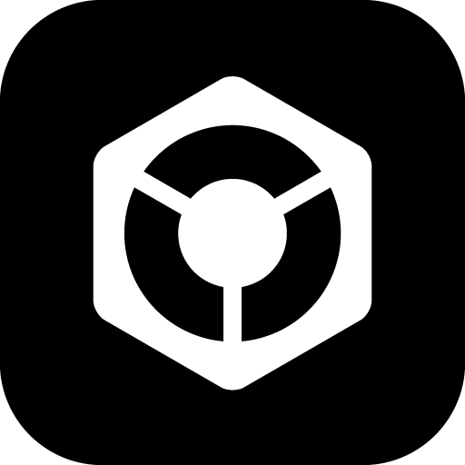

  
  &thinsp;

#### 👨‍💻 About me

- 🔭 I’m working on something cool 😉

- 🌱 I’m currently learning WebGL, Machine Learning

- 💬 Talk to me about anything [here](https://github.com/nooeen/nooeen/issues)

- 👨‍💻 Get to know me and contact me at [neeoon.net](https://neeoon.net)

&thinsp;

#### 📊 Stats

 

&thinsp;

#### 💻 Skill

##### Languages

##### Frameworks/Libraries

##### Backend

##### Deploy

##### Editors

##### Graphics

##### Music

